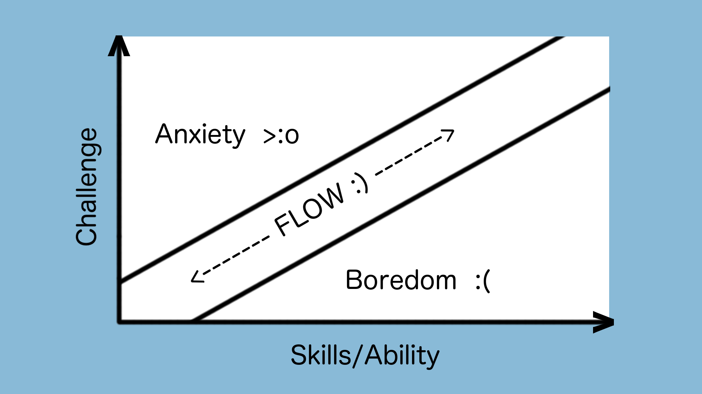

All Your Creates Are Belong To Us
=================================
Taking things further and not being a lazy game designer
--------------------------------------------------------

by [@devjana](https://twitter.com/devjana)

for [IGDATC](http://www.igdatc.org/)

Foundational Game Design
========================

Time/Intensity Graph
--------------------
[Gamasutra Article](http://www.gamasutra.com/blogs/DevJana/20121127/182334/Back_to_basics__IntensityTime_graphs_and_balancing.php)

"Flow State"
------------

Extrinsic v Intrinsic (Dawn of Knowledge)
-----------------------------------------

Modern Game Expectations
------------------------
* Interactivity
* Story
* Level Design
* Enemies/Boss Battles

Case Study: Arkanoid
--------------------

[Case Study: Tetris](http://www.gamasutra.com/blogs/DevJana/20150202/182335/Why_is_Tetris_a_mathematically_perfect_game_design_that_requires_no_tutorial.php)
--------------------

Consider:
=========
* Crates/Barrels
* Health Packs
* Sewer Levels
* Match 3
* Fetch Quests  
* what else?

Personal Failures
=================
* Newt One Coins/Lives

Thanks, don't be lazy, and let's keep the convo going
-----------------------------------------------------
\#lazygamedesign \#igdatc
=========================
[@devjana](https://twitter.com/devjana)
=========================

