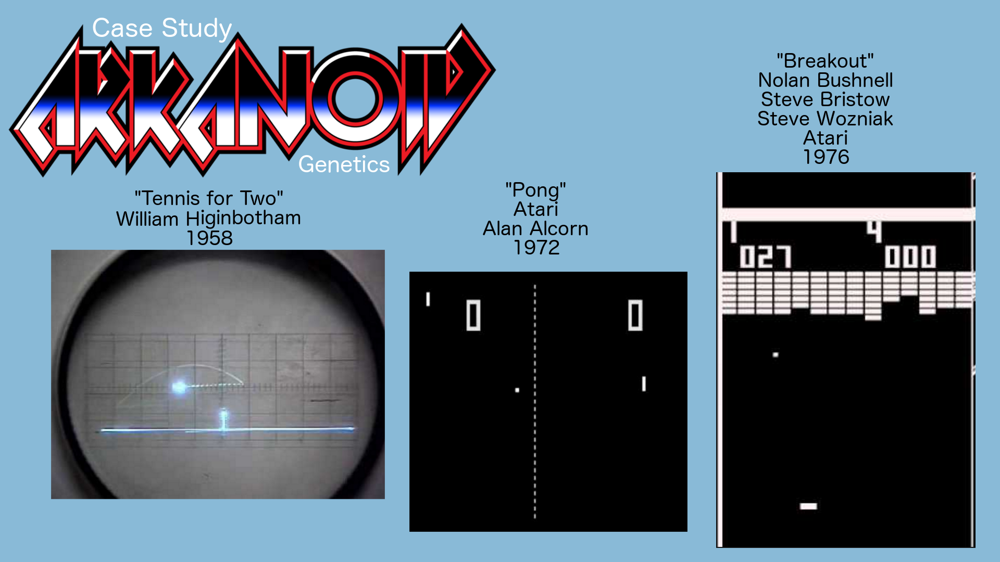
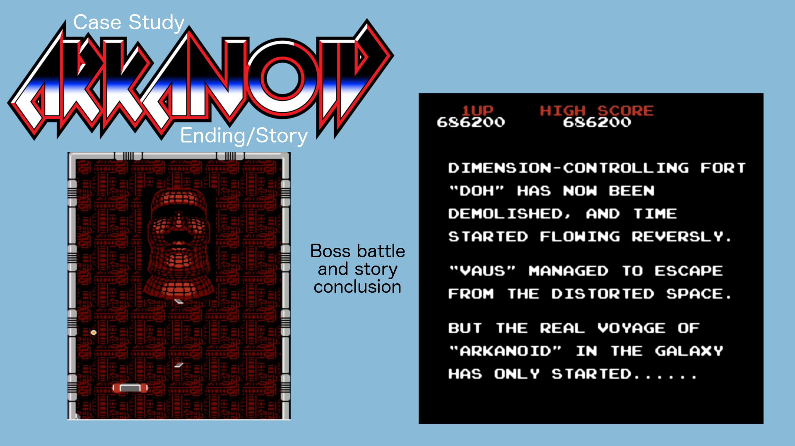

All Your Creates Are Belong To Us
=================================
Taking things further and not being a lazy game designer
--------------------------------------------------------

by [@devjana](https://twitter.com/devjana)

for [IGDATC](http://www.igdatc.org/)

Foundational game design stuff
==============================

Extrinsic v Intrinsic (Dawn of Knowledge)
-----------------------------------------

"Flow State"
------------

Time/Intensity Graph
--------------------
[Gamasutra Article](http://www.gamasutra.com/blogs/DevJana/20121127/182334/Back_to_basics__IntensityTime_graphs_and_balancing.php)

Modern Game Expectations
------------------------
* Interactivity
* Story
* Level Design
* Enemies/Boss Battles

Case Study: Arkanoid
--------------------

Lazy Designs and Dinosaurs
==========================
* Crates/barrels
* Coins/Rings
* Health Packs
* Sewers
* Fetch Quests
* What else?

Personal failures
-----------------
* Newt Coins
* Newt Lives

Next Steps Discussion
---------------------

Thanks, don't be lazy, and let's keep the convo going!
-----------------------------------------------------
\#lazygamedesign \#igdatc
=========================
[@devjana](https://twitter.com/devjana)
